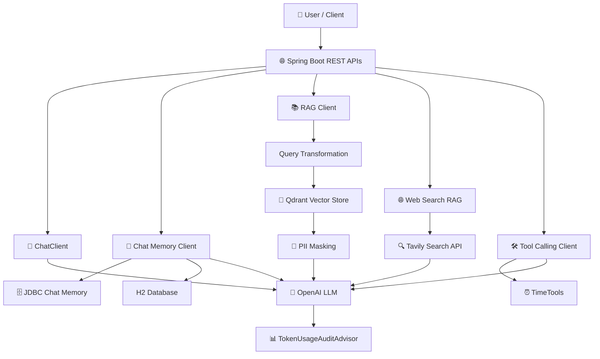

# 🤖 ASK AI — Spring AI RAG & Agentic AI Playground

> A production-oriented **Generative AI application built with Spring Boot 4, Spring AI, OpenAI, RAG, Qdrant Vector Store, Chat Memory, Tool Calling, Web Search and AI observability features**.

**Author:** Amol Sanap  
**Java:** 21  
**Spring Boot:** 4.0.5  
**Spring AI:** 2.0.0-M4

---

## 🚀 Overview

ASK AI is a hands-on Spring AI application demonstrating how an enterprise Java application can integrate LLM capabilities with **Retrieval-Augmented Generation (RAG), persistent conversation memory, vector similarity search, external web search, tool calling, prompt templates, streaming and token-usage auditing**.

The project is structured as multiple focused AI capabilities instead of a single chatbot endpoint, making it useful for learning, demonstrations and technical interviews.

---

## 🧠 Key Capabilities

- 💬 **LLM Chat** using OpenAI through Spring AI
- 📚 **RAG with Qdrant Vector Store**
- 🔎 **Semantic / similarity retrieval** with configurable `topK` and similarity threshold
- 🧠 **Persistent Chat Memory** using Spring AI JDBC repository + H2
- 🌐 **Web Search RAG** using Tavily Search API
- 🛠️ **Tool Calling** for timezone/current-time operations
- 🧩 **Prompt Templates** using StringTemplate files
- 📡 **Streaming AI responses**
- 🧱 **Structured Output** mapped to Java objects
- 🔐 **PII masking** before retrieved documents reach the model
- 📊 **Token Usage Audit** through a custom Spring AI Advisor
- 📝 **Prompt stuffing / contextual prompting** examples
- 🔄 **Query transformation** to English before vector retrieval
- 🐳 **Qdrant via Docker Compose**
- 🏗️ Multiple dedicated `ChatClient` configurations for different AI use cases

---

## 🏗️ Architecture



---

## 🔄 RAG Flow

```text
User Question
     ↓
Query Transformation
     ↓
Vector Similarity Search
     ↓
Qdrant Vector Store
     ↓
Top-K Relevant Documents
     ↓
PII Masking / Document Post Processing
     ↓
Context + User Question
     ↓
OpenAI LLM
     ↓
Final Answer
```

The configured RAG retriever currently uses:

- `topK = 3`
- `similarityThreshold = 0.5`
- Query translation to English
- PII masking document post-processing

---

## 🌐 Web Search RAG Flow

```text
User Question
      ↓
RetrievalAugmentationAdvisor
      ↓
Custom WebSearchDocumentRetriever
      ↓
Tavily Search API
      ↓
Search Results + Metadata
      ↓
OpenAI LLM
      ↓
Answer
```

The custom retriever converts Tavily results into Spring AI `Document` objects containing title, URL, content and relevance score.

---

## 🧠 Chat Memory

ASK AI demonstrates persistent conversational context using Spring AI's JDBC chat-memory repository.

```text
User
 ↓
/chat-memory
 ↓
Conversation ID = username
 ↓
MessageChatMemoryAdvisor
 ↓
JDBC Chat Memory Repository
 ↓
OpenAI
```

This allows subsequent requests using the same conversation identifier to retain previous context.

---

## 🛠️ Tool Calling

The application exposes time-related tools through Spring AI's `@Tool` annotation.

Available tools include:

- `getCurrentLocalTime`
- `getCurrentTime(timeZone)`

Example concept:

```text
User: What time is it in Asia/Kolkata?
             ↓
        LLM decides
             ↓
      getCurrentTime()
             ↓
       Tool execution
             ↓
       Tool response
             ↓
       Final LLM answer
```

This demonstrates the basic **LLM → tool selection → tool execution → response** pattern used in agentic applications.

---

## 📊 AI Observability — Token Usage Audit

`TokenUsageAuditAdvisor` captures token consumption from the Spring AI `ChatResponse` metadata.

It logs:

- Prompt tokens
- Completion tokens
- Total tokens

Example:

```text
Prompt tokens used: 120
Completion tokens used: 45
Total tokens used: 165
```

This provides a foundation for AI cost and usage monitoring.

> For full production observability, this can be extended with OpenTelemetry, metrics, traces, dashboards and centralized logging.

---

## 🔐 PII Protection

The RAG pipeline includes a custom `PIIMaskingDocumentPostProcessor`.

Its purpose is to process retrieved documents before they are supplied to the LLM, reducing the chance of exposing sensitive information unnecessarily.

```text
Vector Store
    ↓
Retrieved Documents
    ↓
PII Masking Processor
    ↓
Sanitized Context
    ↓
LLM
```

---

## 📁 Project Structure

```text
ASK_AI/
├── src/
│   ├── main/
│   │   ├── java/com/askai/
│   │   │   ├── config/
│   │   │   │   ├── ChatClientConfig.java
│   │   │   │   ├── ChatMemoryChatClientConfig.java
│   │   │   │   ├── TimeChatClientConfig.java
│   │   │   │   └── WebSearchRAGChatClientConfig.java
│   │   │   │
│   │   │   ├── controller/
│   │   │   │   ├── ChatController.java
│   │   │   │   ├── ChatMemoryController.java
│   │   │   │   ├── PromptTemplateController.java
│   │   │   │   ├── PromptStuffingController.java
│   │   │   │   ├── RagController.java
│   │   │   │   ├── StreamController.java
│   │   │   │   ├── StructuredOutputController.java
│   │   │   │   └── TimeController.java
│   │   │   │
│   │   │   ├── rag/
│   │   │   │   ├── HRPolicyLoader.java
│   │   │   │   ├── RandomDataLoader.java
│   │   │   │   ├── WebSearchDocumentRetriever.java
│   │   │   │   └── PIIMaskingDocumentPostProcessor.java
│   │   │   │
│   │   │   ├── advisors/
│   │   │   │   └── TokenUsageAuditAdvisor.java
│   │   │   │
│   │   │   ├── tool/
│   │   │   │   └── TimeTools.java
│   │   │   │
│   │   │   └── model/
│   │   │       └── CountryCities.java
│   │   │
│   │   └── resources/
│   │       ├── application.yaml
│   │       ├── HR_Policies.pdf
│   │       ├── schema/schema-h2db.sql
│   │       └── promptTemplate/
│   │           ├── systemPromptTemplate.st
│   │           ├── systemPromptRandomDataTemplate.st
│   │           └── userPromptTemplate.st
│   │
│   └── test/
│       └── java/com/askai/DemoApplicationTests.java
│
├── compose.yml
├── pom.xml
└── README.md
```

---

## 🔌 Main API Areas

The application exposes REST controllers under:

```text
/api/v1
```

### Basic Chat

```http
GET /api/v1/chat?message=Hello
```

### Chat Memory

```http
GET /api/v1/chat-memory?message=Hello
username: amol
```

The `username` header is used as the conversation identifier in the current implementation.

Other controller areas cover:

- RAG
- Prompt templates
- Prompt stuffing
- Streaming
- Structured output
- Time / tool calling

Check the corresponding controller classes for the exact endpoint signatures.

---

## ⚙️ Configuration

### OpenAI API Key

Set the following environment variable:

```bash
OPENAI_API_KEY=your_openai_api_key
```

### Tavily API Key

The web-search retriever reads:

```bash
TAVILY_SEARCH_API_KEY=your_tavily_api_key
```

Do **not** commit API keys into source control.

---

## 🐳 Start Qdrant

The project includes Docker Compose configuration:

```yaml
services:
  qdrant:
    image: 'qdrant/qdrant:latest'
    ports:
      - '6333:6333'
      - '6334:6334'
```

Start it with:

```bash
docker compose up -d
```

Qdrant is configured on:

```text
localhost:6334
```

Collection:

```text
collection
```

---

## ▶️ Run the Application

### Prerequisites

- Java 21+
- Maven 3.9+
- Docker Desktop / Docker Engine
- OpenAI API key
- Tavily API key for web-search functionality

### Start

```bash
mvn clean spring-boot:run
```

Application port:

```text
http://localhost:2020
```

---

## 📦 Important Dependencies

| Technology | Purpose |
|---|---|
| Java 21 | Application runtime |
| Spring Boot 4.0.5 | Application framework |
| Spring AI 2.0.0-M4 | AI integration layer |
| OpenAI | LLM provider |
| Qdrant | Vector store |
| Spring AI RAG | Retrieval Augmented Generation |
| H2 | Local database / chat-memory support |
| JDBC Chat Memory | Persistent conversation context |
| Tavily | Web search retrieval |
| Docker Compose | Local infrastructure |
| Tika Document Reader | Document ingestion |

---

## 🧩 Design Patterns Demonstrated

### Retrieval-Augmented Generation

Separates knowledge retrieval from model generation so the model can answer using application-specific context.

### Advisor Pattern

Spring AI Advisors are used for cross-cutting AI behavior such as:

- Logging
- Memory
- Retrieval augmentation
- Token auditing

### Tool Calling

Allows the LLM to invoke application-defined Java functions when external computation or information is required.

### Query Transformation

Transforms the incoming query before retrieval to improve compatibility with the indexed knowledge base.

### Document Post Processing

Sanitizes retrieved context before it reaches the LLM.


---

## 🔮 Future Enhancements

Potential next steps for turning this into a broader enterprise AI platform:

- OpenTelemetry based AI tracing
- Prometheus + Grafana dashboards
- Centralized AI logs
- Model latency and error metrics
- Token-cost dashboards
- Redis caching for repeated retrievals
- Multiple model/provider support
- Agent orchestration
- MCP integrations
- Guardrails and content safety
- Evaluation pipelines for RAG quality
- Automated prompt/version management
- Authentication and authorization
- Production-grade PostgreSQL persistence

> **Note:** Redis/cache is listed as a future enhancement because the current uploaded implementation does not contain a dedicated cache dependency or cache configuration.

---

## 👨‍💻 Author

**Amol Sanap**  
Senior Software Engineer | Java | Spring Boot | Microservices | GenAI | Agentic AI

---

## ⭐ Purpose

This repository is intended as a practical reference for developers learning how to integrate **Generative AI and RAG capabilities into modern Java/Spring Boot applications**.

If you find it useful, consider giving the repository a ⭐.
